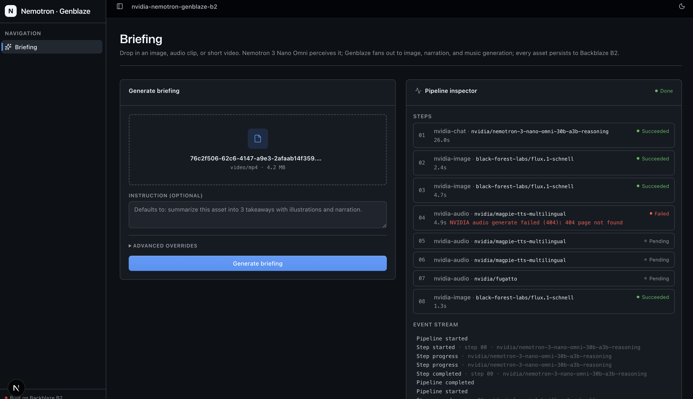

# nvidia-nemotron-genblaze-b2

A Genblaze reference app built around **NVIDIA Nemotron 3 Nano Omni** —
the open omni-modal "perception sub-agent." Drop in an image, audio
clip, or short video; Nemotron sees, hears, and reasons; Genblaze fans
out to image, narration, and music generation; every artifact persists
to Backblaze B2.



```
upload (image | audio | video) ──> POST /uploads (B2-staged, sha256'd)
   │
   │  Nemotron 3 Nano Omni  ─────> JSON-schema-enforced BriefingSpec:
   │  (NvidiaChatProvider)           title, summary, 3 takeaways
   │                                 (headline + illustration_prompt
   │                                  + narration), music_prompt
   │
   ├──> image x3 (FLUX.1 Schnell)  ─> takeaway illustrations  (parallel)
   ├──> audio x3 (Riva TTS)        ─> takeaway narrations     (parallel)
   ├──> audio   (Fugatto)          ─> ambient soundtrack
   └──> video   (Cosmos)           ─> optional, opt-in via include_video
                                                 │
                                                 ▼
                              B2 bucket: nemotron/<run-id>/...
                              + manifest.json with provenance
```

Every step is one Genblaze call. Every asset lands in B2 with a
hierarchical key. Every run drops a `manifest.json` carrying the
pipeline name, model ids, prompts, and asset SHA-256s.

## Quickstart

### Prerequisites

- Node.js >= 20 and `pnpm` >= 9
- Python >= 3.11 and [`uv`](https://docs.astral.sh/uv/)
- An `nvapi-` key from <https://build.nvidia.com> (one key covers
  chat, image, TTS, and music)
- A Backblaze B2 bucket and Application Key — see
  [`infra/README.md`](infra/README.md) for the minimal capability set

### Configure once

```bash
# repo root
cp .env.example .env
# fill in B2_KEY_ID, B2_APPLICATION_KEY, B2_BUCKET_NAME, B2_REGION,
# B2_ENDPOINT, and NVIDIA_API_KEY
```

The repo uses a **single `.env` file at the repo root**. The FastAPI
service reads it through `services/api/app/config.py` (looks at
`./.env` then `../../.env`); the Next.js proxy has a `127.0.0.1:8787`
default and only needs `NEMOTRON_API_URL` if you're pointing at a
non-local API.

### Install + run

```bash
pnpm install               # first time: install web deps
pnpm dev                   # boots api (uvicorn) + web (next) concurrently
```

Open <http://localhost:3737>, drop in an image / audio / video, and
click **Generate briefing**.

If you'd rather run them in separate terminals:

```bash
pnpm dev:api               # uvicorn on 127.0.0.1:8787
pnpm dev:web               # next on :3737
```

## Architecture

See [`ARCHITECTURE.md`](ARCHITECTURE.md) for the layer diagram. TL;DR:

- `services/api/app/repo/pipelines.py` is the **only** file that
  imports `genblaze_*`. A structural test asserts this in CI.
- FastAPI handlers return Genblaze `Run` / `Step` / `Asset` Pydantic
  models directly. The only sample-side DTOs are `BriefingRequest`,
  `UploadResponse`, and `BriefingSpec` (which doubles as the chat
  step's `response_format=`).
- `S3StorageBackend.for_backblaze(...)` is invoked with explicit
  `key_id=` / `app_key=` kwargs.
- Per-app provenance is carried in the
  `Pipeline(name="nvidia-nemotron-genblaze-b2")` slug, which
  `genblaze-s3` writes into every B2 manifest.
- The Next.js layout chrome (sidebar, header, theme toggle, design
  tokens, shadcn primitives) is built on the
  [`vibe-coding-starter-kit`](https://github.com/backblaze-labs/vibe-coding-starter-kit).

## Supported NVIDIA models (defaults)

| Modality | Default model                                       | Override env / request field |
| -------- | --------------------------------------------------- | ---------------------------- |
| Chat     | `nvidia/nemotron-3-nano-omni-30b-a3b-reasoning`     | `NEMOTRON_CHAT_MODEL`        |
| Image    | `black-forest-labs/flux.1-schnell`                  | `NEMOTRON_IMAGE_MODEL`       |
| TTS      | `nvidia/magpie-tts-multilingual`                    | `NEMOTRON_TTS_MODEL`         |
| Music    | `nvidia/fugatto`                                    | `NEMOTRON_MUSIC_MODEL`       |
| Video    | `nvidia/cosmos-2.0-diffusion-text2world` (opt-in)   | `NEMOTRON_VIDEO_MODEL`       |

Any chat / image / video model id NVIDIA NIM serves works as a
free-form string. `GET /models` lists the curated registry per
provider. Set `NEMOTRON_REASONING=false` to skip the reasoning trace.

## Tests

```bash
pnpm test:api              # pytest
pnpm lint:api              # ruff
pnpm lint                  # eslint on the web app
```

Smoke tests don't call NVIDIA / B2 — they verify the live SDK surface
still supports the shapes `repo/pipelines.py` uses, so an upstream
rename fails fast.

## License

MIT — see [`LICENSE`](LICENSE).
